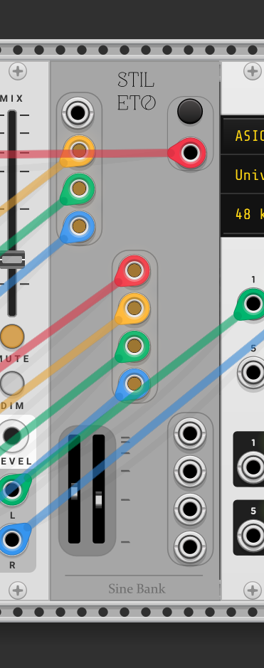

# StiletoAudio-VCV
My VCV Rack plugin / modules

***

### SineBank
A simple 12 oscillator sine wave bank with random frequency generation and range sliders.
- The top right button resets all oscillator frequencies randomly based on user defined range (via sliders)
- Below this button, we have a gate input which may also be used to re-trigger random frequency generation.
- the bottom left sliders determine the range of frequencies, (20Hz to 10kHz), from which random frequencies
may be derived.

  

### VCABank
A very simple bank of 10 VCAs; Linear ramp.
- Planning to implement user option to switch from linear to log; random envelope generator per VCA attenuator;

  
</p

# Roadmap
- WavetableBank: Same concept as SineBank, but with wavetable oscillators
- VCABank: A simple bank of twelve VCAs with linear and exponential implementation
- Salvador: Clock generator with 12 sources; scaled but with some randomness
- Time domain filters, (FIR, IIR)
- Music GPT driven oscillator
